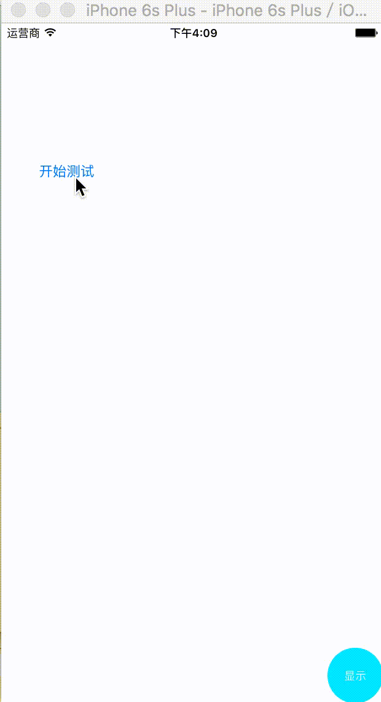

# MLSDebugView
一个轻量级查看log日志控件，再也不担心被说参数传错啦！！！
最上方的log日志，是最新的log日志



### 使用方法
1.可以在pch文件中插入下面两句代码

```
// 使用该宏定义，可以替换系统的NSLog
#define USE_MLSLOG
#import "MLSDebugManager.h"
如果使用的是framework
则引入头文件
#import <MLSDebugManager/MLSDebugManager.h>

```

2.在AppDelegate中的下面方法中，写下自定义参数

```
- (BOOL)application:(UIApplication *)application didFinishLaunchingWithOptions:(NSDictionary *)launchOptions
{
		// 开启DebugView
        [[MLSDebugInstance shareInstance] start];
        
        // 下面的参数是可定义参数
        
        // 是否同时在终端输出
        // [[MLSDebugInstance shareInstance] setDebug:YES];
        
        // 最大允许保留的日志个数
        // [MLSDebugInstance shareInstance].maxLogCount = 10000;
        
        // 最大允许占用的内存大小 （KB）
        // [MLSDebugInstance shareInstance].maxMemory = 10000.0;
        
        return YES;
}
```

